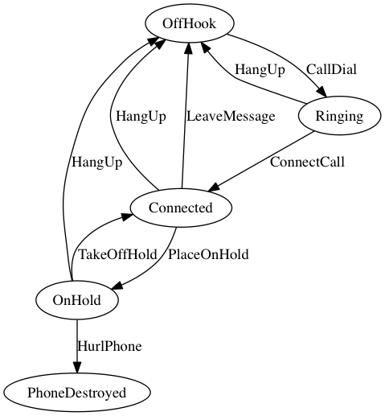
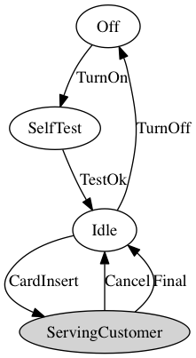
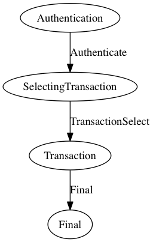

# A State Machine implementation in Java

Simple State Machine with transitions, guards, composite state.

...but without sub-state machine, deferred signals, event queues...

Define the State Machine by subclassing State Machine and using the builders in the constructor. Se tests for usage.

<!-- language: lang-java -->
        State onHold = state(ON_HOLD)
                .transition(HURL_PHONE).guardedBy(event -> PHONE_HURLED_AGAINST_WALL.equals(event.getName()))
                .to(phoneDestroyed)
                .transition(HANG_UP).guardedBy(event -> HUNG_UP.equals(event.getName()))
                .to(offHook)
                .transition(TAKE_OFF_HOLD).onTransition(stopMuzak).guardedBy(event -> TOOK_OFF_HOLD.equals(event.getName()))
                .to(connected)
                .build();

## State Machine used in the unit tests

### Phone State Machine Diagram
Inspired by [simplestatemachine](http://simplestatemachine.codeplex.com/)

Generated from code by [Graphviz](http://www.graphviz.org/):

### ATM State Machine Diagram
Inspired by [ATM Bank](http://www.uml-diagrams.org/bank-atm-uml-state-machine-diagram-example.html)

Generated from code by [Graphviz](http://www.graphviz.org/):

and the composite state ServingCustomer

A model containing the whole state machine (not generated from code)

