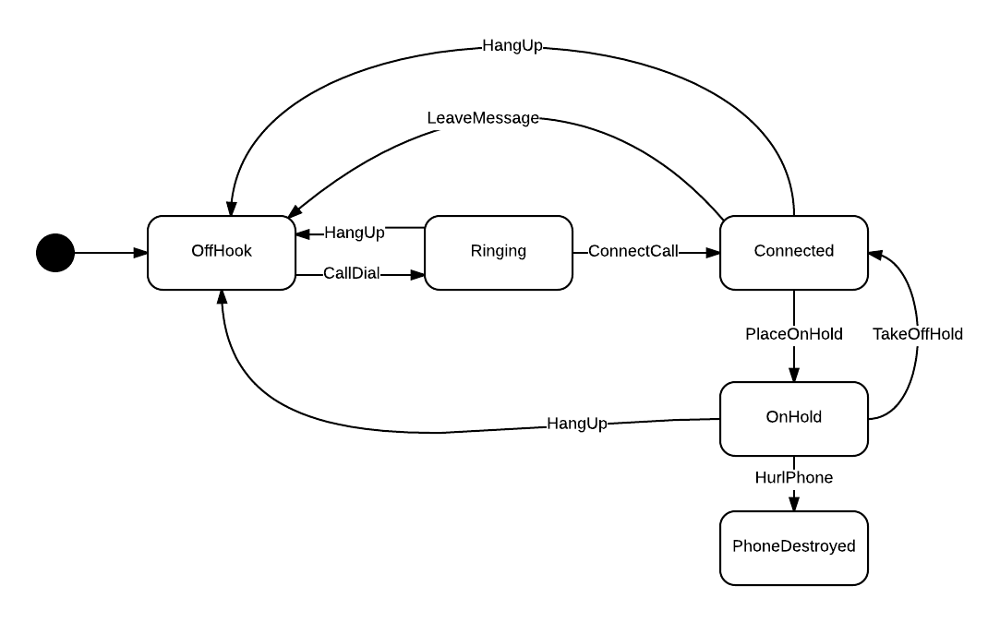
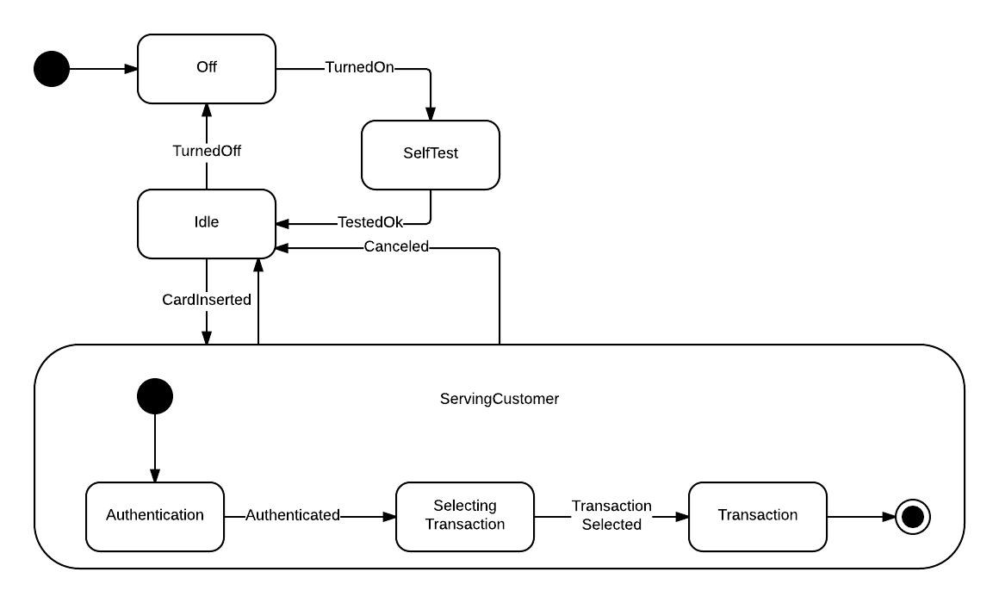

# A State Machine implementation in Java

Simple State Machine with transitions, guards, composite state.

...but without sub-state machine, deferred signals, queues and no runtime engine environment.

Define the State Machine by subclassing State Machine and using the builders in the constructor. Se tests for usage.

<!-- language: lang-java -->
    State ringing = state(RINGING)
        .transition().guardedBy(event -> event.getName().equals(CONNECT_CALL))
        .to(connected)
        .transition().guardedBy(event -> event.getName().equals(HANG_UP))
        .to(offHook)
        .build();

## State Machine used in the unit tests

### Phone State Machine Diagram
Inspired by [simplestatemachine](http://simplestatemachine.codeplex.com/)

### ATM State Machine Diagram
Inspired by [ATM Bank](http://www.uml-diagrams.org/bank-atm-uml-state-machine-diagram-example.html)

